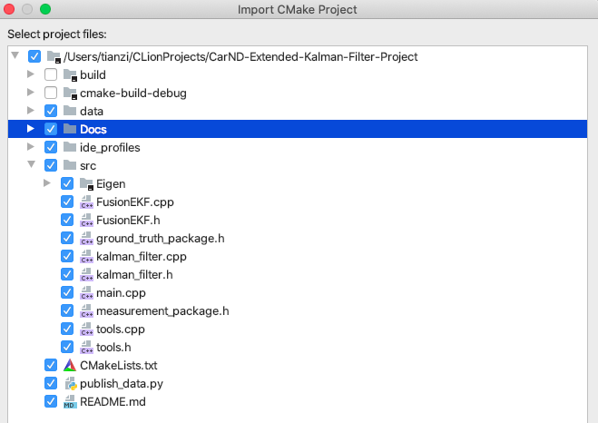
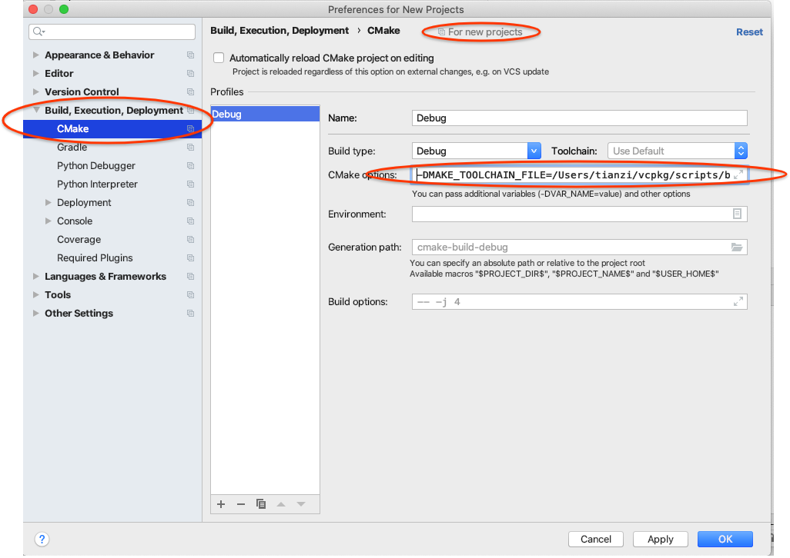

# Extended Kalman Filter with Google Cloud Pub/Sub
This project was originally homework from the [Udacity Self-Driving Car Engineer Nanodegree] Program. I re-purposed it for a [Medium article] to show how to use [Pub/Sub] with Kalman Filters.

---

## Dependencies

* cmake >= 3.5
 * All OSes: [click here for installation instructions](https://cmake.org/install/)
* make >= 4.1
  * Linux: make is installed by default on most Linux distros
  * Mac: [install Xcode command line tools to get make](https://developer.apple.com/xcode/features/)
  * Windows: [Click here for installation instructions](http://gnuwin32.sourceforge.net/packages/make.htm)
* gcc/g++ >= 5.4
  * Linux: gcc / g++ is installed by default on most Linux distros
  * Mac: same deal as make - [install Xcode command line tools]((https://developer.apple.com/xcode/features/)
  * Windows: recommend using [MinGW](http://www.mingw.org/)

## Pub/Sub setup

1. Install the [Cloud SDK].

1. Create a new Google Cloud project via the [*New Project*] page.

1. [Enable billing].

1. Initialize the Cloud SDK to your GCP project.

   ```shell script
   gcloud init
   ```

1. [Enable the API](https://console.cloud.google.com/flows/enableapi?apiid=pubsub): Pub/Sub.

1. Create a service account JSON key via the [*Create service account key*] page.

   * From the **Service account** list, select **New service account**.
   * In the **Service account name** field, enter a name.
   * From the **Role** list, select **Project > Owner** **(*)**.
   * Click **Create**. A JSON file that contains your key downloads to your computer.

1. Set your `GOOGLE_APPLICATION_CREDENTIALS` environment variable to point to your service account key file.

   ```shell script
   export GOOGLE_APPLICATION_CREDENTIALS=path/to/your/credentials.json
   ```

1. Create a Pub/Sub topic and subscription.

    ```bash
    gcloud pubsub topics create my-topic
    gcloud pubsub subscriptions create my-subscription --topic=my-topic --enable-message-ordering
    ```
   
1. Additional step for the Pub/Sub C++ client library if you are on MacOS or Windows. Download gRPC SSL certificates and set the environment variable `GRPC_DEFAULT_SSL_ROOTS_FILE_PATH`.
   - MacOS 
    ```shell script
    curl -Lo roots.pem https://raw.githubusercontent.com/grpc/grpc/master/etc/roots.pem
    export GRPC_DEFAULT_SSL_ROOTS_FILE_PATH="$PWD/roots.pem"
    ```
   - Windows
   ```shell script
    @powershell -NoProfile -ExecutionPolicy unrestricted -Command ^
        (new-object System.Net.WebClient).Downloadfile( ^
            'https://raw.githubusercontent.com/grpc/grpc/master/etc/roots.pem', ^
            'roots.pem')
    set GRPC_DEFAULT_SSL_ROOTS_FILE_PATH=%cd%\roots.pem
    ```

## Build Instructions

1. Clone this repo.
1. Make a new CMake Project.
   - CLion:
     - Go to Files > New CMake Project from Sources.
       
     - Install `google-cloud-cpp` using [vcpkg]. 
       ```shell script
       cd $HOME/vcpkg
       ./vcpkg install google-cloud-cpp
       ```
     - Configure CMake for your project.
       - Using the CLI:
         ```shell script
         cmake -H. -B.build -DCMAKE_TOOLCHAIN_FILE=$HOME/vcpkg/scripts/buildsystems/vcpkg.cmake
         ```
       - Using the UI: 
1. Compile: `cmake --build .build`
1. Publish some messages with an ordering key.

   ```shell script
   # Publishes messages synchronously (slow way).
   ./publish.sh
   
   # Publishes messages asynchronously (fast way)
   python publish_data.py
   ```
1. Run the EKF: `./ExtendedKF your-project-id your-subscription-id`
   

## Code Style

Please (do your best to) stick to [Google's C++ style guide](https://google.github.io/styleguide/cppguide.html).

## Generating Additional Data (Optional)

If you'd like to generate your own radar and lidar data, see the [utilities repo](https://github.com/udacity/CarND-Mercedes-SF-Utilities) for Matlab scripts that can generate additional data.


## IDE Profiles Pull Requests

If you've created a profile for an IDE that you think others would appreciate, add the requisite profile files and instructions to ide_profiles/. For example, if you want to add a VS Code profile, you would add:

* `/ide_profiles/vscode/.vscode`
* `/ide_profiles/vscode/README.md`

The README should explain what the profile does, how to take advantage of it, and how to install it.

[Udacity Self-Driving Car Engineer Nanodegree]: https://www.udacity.com/course/self-driving-car-engineer-nanodegree--nd013
[Medium article]: https://medium.com/@anguillanneuf/about
[Pub/Sub]: https://cloud.google.com/pubsub/docs

[Cloud SDK]: https://cloud.google.com/sdk/docs
[Cloud Shell]: https://console.cloud.google.com/cloudshell/editor/
[*New Project*]: https://console.cloud.google.com/projectcreate
[Enable billing]: https://cloud.google.com/billing/docs/how-to/modify-project/
[*Create service account key*]: https://console.cloud.google.com/apis/credentials/serviceaccountkey/
[GCP Console IAM page]: https://console.cloud.google.com/iam-admin/iam/
[Granting roles to service accounts]: https://cloud.google.com/iam/docs/granting-roles-to-service-accounts/
[Creating and managing service accounts]: https://cloud.google.com/iam/docs/creating-managing-service-accounts/

[vcpkg]: https://github.com/Microsoft/vcpkg.git