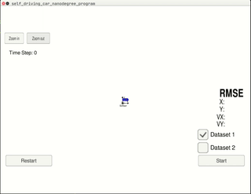
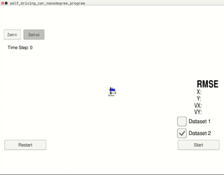
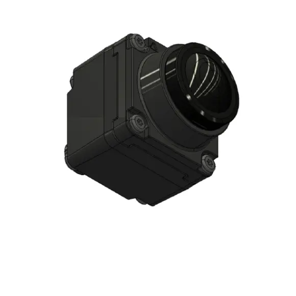
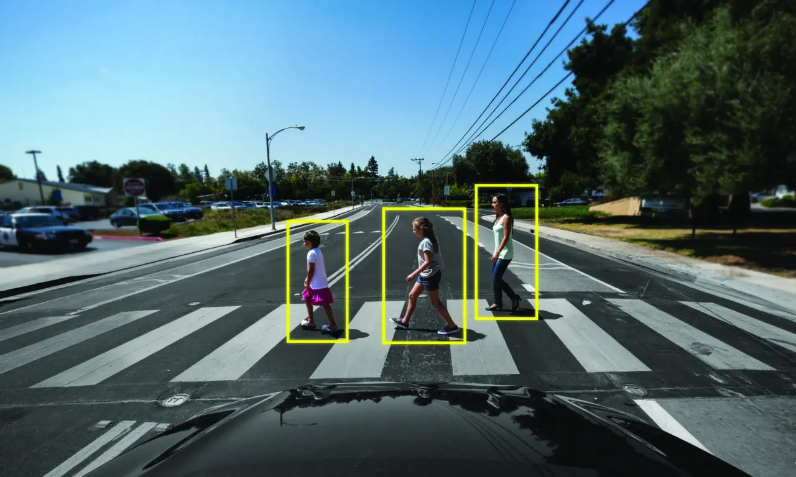
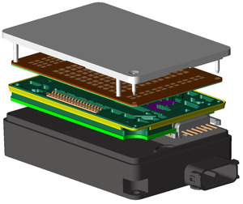
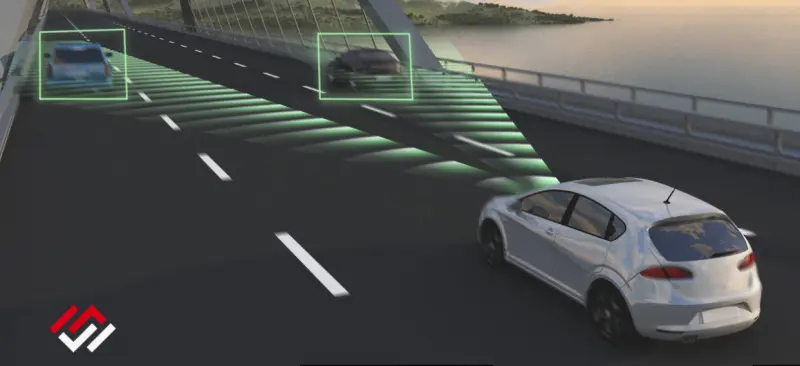
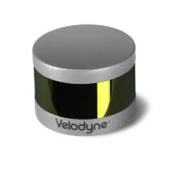
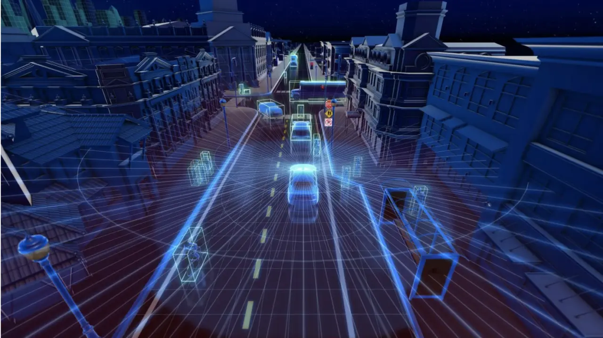
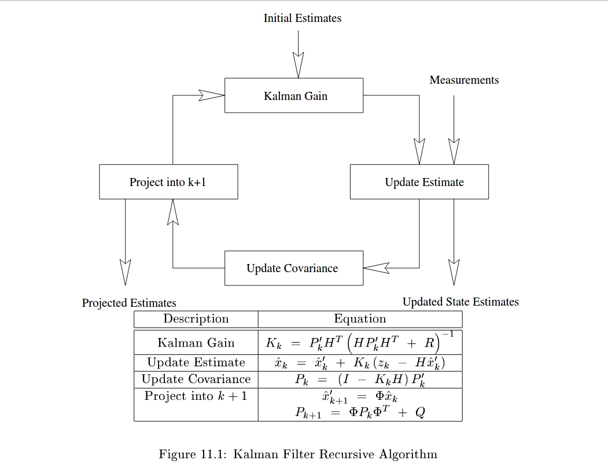
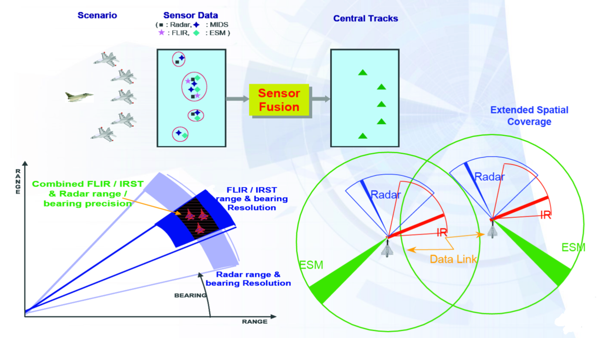

Project: Extended Kalman Filter
---

[](http://www.udacity.com/drive)

### Introduction
The major objective of this project is to implement a Kalman filter using *C++* as a primary tool and tests with the [`Udacity simulator`](https://github.com/udacity/self-driving-car-sim). I'll discuss the following details to understand few theoretical concepts used to implement this project.

* Sensors
* Kalman filter
* Extended Kalman filter
* Sensor fusion

|  |  |
|-------------------------------|-------------------------------|
|[*Dataset 01*](https://youtu.be/me-b7wNDdX4)| [*Dataset 02*](https://youtu.be/UQJ7q2JMteM)|

#### Sensors

*The three primary autonomous vehicle sensors are camera, radar and lidar. Working together, they provide the car visuals of its surroundings and help it detect the speed and distance of nearby objects, as well as their three-dimensional shape.  
In addition, sensors known as inertial measurement units help track a vehicle’s acceleration and location [[Ref]](https://blogs.nvidia.com/blog/2019/04/15/how-does-a-self-driving-car-see/)* 

##### Camera

*Autonomous vehicles rely on cameras placed on every side - front, rear, left and right - to stitch together a 360-degree view of their environment. Some have a wide field of view - as much as 120 degrees - and a shorter range. Others focus on a more narrow view to provide long-range visuals[[Ref]](https://blogs.nvidia.com/blog/2019/04/15/how-does-a-self-driving-car-see/).*

|||
|---------------------------------|---------------------------------------------------------------------------|
|Source: [How Does a Self-Driving Car See?](https://blogs.nvidia.com/blog/2019/04/15/how-does-a-self-driving-car-see/)|A camera sensor in action|

##### Radar
*Radar sensors can supplement camera vision in times of low visibility, like night driving, and improve detection for self-driving cars.
Traditionally used to detect ships, aircraft and weather formations, radar works by transmitting radio waves in pulses. Once those waves hit an object, they return to the sensor, providing data on the speed and location of the object[[Ref]](https://blogs.nvidia.com/blog/2019/04/15/how-does-a-self-driving-car-see/).*

|||
|---------------------------------|-------------------------------------------------------------------------------|
|Source: [Automotive Radar Simulation Software](https://www.remcom.com/automotive-radar)|A radar sensor in action|


##### Lidar

*Lidar makes it possible for self-driving cars to have a 3D view of their environment. It provides shape and depth to surrounding cars and pedestrians as well as the road geography. And, like radar, it works just as well in low-light conditions.
By emitting invisible lasers at incredibly fast speeds, lidar sensors are able to paint a detailed 3D picture from the signals that bounce back instantaneously. These signals create “point clouds” that represent the vehicle’s surrounding environment to enhance safety and diversity of sensor data[[Ref]](https://blogs.nvidia.com/blog/2019/04/15/how-does-a-self-driving-car-see/).*


|||
|---------------------------------|-------------------------------------------------------------------------------|
|Source: [How Does a Self-Driving Car See?](https://blogs.nvidia.com/blog/2019/04/15/how-does-a-self-driving-car-see/)|A lidar sensor in action|


### Kalman Filter
*The Kalman filter keeps track of the estimated state of the system and the variance or uncertainty of the estimate[[Ref]](https://en.wikipedia.org/wiki/Kalman_filter).*

Following is the Kalman filter recursive algorithm.



Following is the *C++*(C++ 14 standards) implementation of Kalman filter. [Eigen](http://eigen.tuxfamily.org/dox/)(version 3.3.9) library was used to do matrices related operations.  

```cpp
// state vector
Eigen::VectorXd x_;

// state covariance matrix
Eigen::MatrixXd P_;

// state transition matrix
Eigen::MatrixXd F_;

// process covariance matrix
Eigen::MatrixXd Q_;

// measurement matrix
Eigen::MatrixXd H_;

// measurement covariance matrix
Eigen::MatrixXd R_;
```
Following is the Kalman filter **Predict** function implementation.

```cpp
void KalmanFilter::Predict()
{
    x_ = F_ * x_;
    MatrixXd Ft = F_.transpose();
    P_ = F_ * P_ * Ft + Q_;
}
```

Following is the Kalman filter **Update** function implementation.

```cpp
void KalmanFilter::Update(const VectorXd &z)
{
    VectorXd z_pred = H_ * x_;
    VectorXd y = z - z_pred;
    CommonUpdate(y);
}
void KalmanFilter::CommonUpdate(const VectorXd &y)
{
    MatrixXd Ht = H_.transpose();
    MatrixXd S = H_ * P_ * Ht + R_;
    MatrixXd Si = S.inverse();
    MatrixXd PHt = P_ * Ht;
    MatrixXd K = PHt * Si;

    //new estimate
    x_ = x_ + (K * y);
    long x_size = x_.size();
    MatrixXd I = MatrixXd::Identity(x_size, x_size);
    P_ = (I - K * H_) * P_;
}
```

### Extended Kalman Filter
*The extended Kalman filter (EKF) is the nonlinear version of the Kalman filter which linearizes about an estimate of the current mean and covariance[[Ref]](https://en.wikipedia.org/wiki/Extended_Kalman_filter).* Following the is *C++* implementation for **EKF Update** function.

```cpp
void KalmanFilter::UpdateEKF(const VectorXd &z)
{
    float px = x_(0);
    float py = x_(1);
    float vx = x_(2);
    float vy = x_(3);

    float rho = sqrt(px * px + py * py);
    
    // Handle divided by zero
    if (rho < 0.00001)
    {
        px += 0.001;
        py += 0.001;
        rho = sqrt(px * px + py * py);
    }

    float phi = atan2(py, px);
    float rho_dot = (px * vx + py * vy) / rho;

    VectorXd hx(3);
    hx << rho, phi, rho_dot;

    VectorXd y = z - hx;

    // Normalize angle to within -PI and PI if needed
    while (y(1) > M_PI || y(1) < -M_PI)
    {
        if (y(1) > M_PI) y(1) -= M_PI;
        else if (y(1) < -M_PI) y(1) += M_PI;
    }

    CommonUpdate(y);
}
```

Kalman filter prediction accuracy will be calculated by using the [RMSE](https://en.wikipedia.org/wiki/Root-mean-square_deviation) metric. Following is the *C++* implementation of RMSE.

```cpp
VectorXd Tools::CalculateRMSE(const vector<VectorXd> &estimations,
                              const vector<VectorXd> &ground_truth)
{

    VectorXd rmse(4);
    rmse << 0, 0, 0, 0;

    if (estimations.size() != ground_truth.size() or estimations.empty())
    {
        cout << "Invalid estimation or ground thruth data\n";
        return rmse;
    }

    // accumulate squared residuals
    for (size_t i = 0; i < estimations.size(); ++i)
    {
        VectorXd residual = estimations[i] - ground_truth[i];
        residual = residual.array() * residual.array();
        rmse += residual;
    }

    rmse = rmse / estimations.size();
    rmse = rmse.array().sqrt();

    return rmse;
}

```

### Sensor Fusion
*Sensor fusion is combining of sensory data or data derived from disparate sources such that the resulting information has less uncertainty than would be possible when these sources were used individually. The term uncertainty reduction, in this case, can mean more accurate, more complete, or more dependable, or refer to the result of an emerging view, such as stereoscopic vision (calculation of depth information by combining two-dimensional images from two cameras at slightly different viewpoints)[[Ref]](https://en.wikipedia.org/wiki/Sensor_fusion).*

||
|-----------------------------------------------------|
|Source: [Wikimedia](https://upload.wikimedia.org/wikipedia/commons/f/f9/Eurofighter_sensor_fusion.png)|

[`FusionEKF.cpp`](src/FusionEKF.cpp) can be referred to find more details about fusion.

### References
* https://www.udacity.com/course/self-driving-car-engineer-nanodegree--nd013
* https://www.youtube.com/watch?v=mwn8xhgNpFY&list=PLn8PRpmsu08pzi6EMiYnR-076Mh-q3tWr
* https://www.youtube.com/watch?v=6qV3YjFppuc&list=PLn8PRpmsu08ryYoBpEKzoMOveSTyS-h4a
* https://medium.com/think-autonomous/how-radars-work-1eb523893d62
* https://blogs.nvidia.com/blog/2019/04/15/how-does-a-self-driving-car-see/
* https://www.remcom.com/automotive-radar
* http://web.mit.edu/kirtley/kirtley/binlustuff/literature/control/Kalman%20filter.pdf
* https://www.khanacademy.org/math/statistics-probability/modeling-distributions-of-data/more-on-normal-distributions/v/introduction-to-the-normal-distribution

### Acknowledgments
Big thank you to [Udacity](https://www.udacity.com) for providing the template code and simulator for this project.

