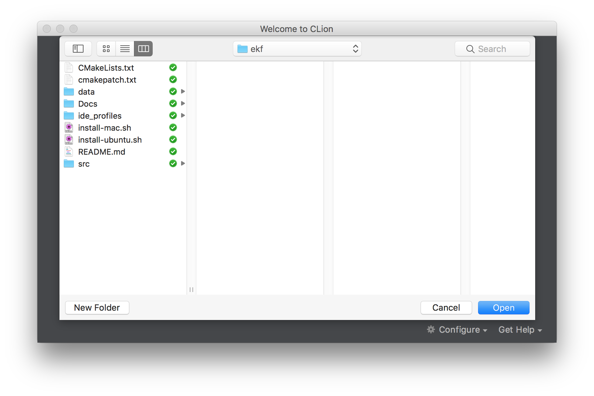
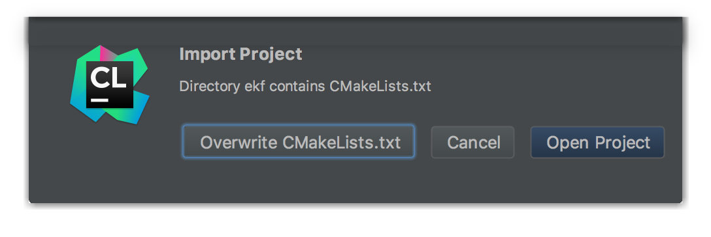
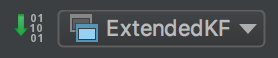

## CLion IDE profile

### Where is CLion IDE profile?

You will generate one! Because IDE profiles can contain paths specific to your machine, we think the best way to get a CLion IDE profile for this project is to allow CLion to use the included CMakeLists.txt to create your project. Don't worry, it is really easy.

### How to generate CLion IDE profile?

Assuming you already have CLion installed, you'll first need to import the project from the sources. To do this, open the CLion application in the project directory (../../ from here). Once you get the initial dialog box, click on "Import Project From Sources" and select the appropriate directory. This should be the project root directory that contains `CMakeLists.txt`.

Once you select the directory, you will be presented with another dialog box that contains three choices. Make sure to select "Open Project" rather than "Overwite CMakeLists.txt". That's it!

### How to build using CLion IDE profile?

Once CLion has opened up and finished indexing the sources, you should be ready to modify the sources and/or build the project. To build, you can click on the Build button towards the top right, select Run->Build from the menus, or press your system's build keyboard shortcut.

You may then run or debug the project by clicking on the Run or Debug buttons to the right of the project name at the top, by selecting "Run ExtendedKF" or "Debug ExtendedKF" from the Run menu, or by pressing your system's run or debug keyboard shortcuts.

Enjoy!