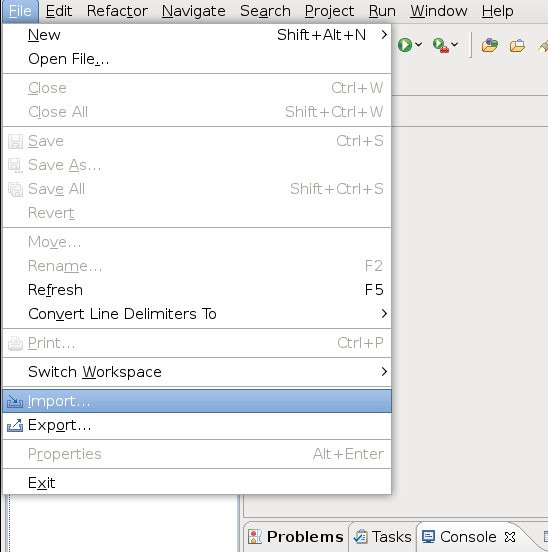
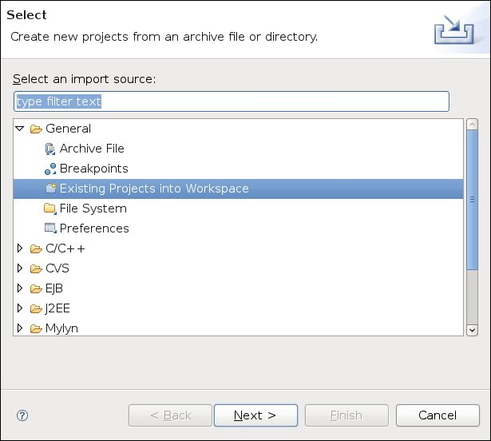
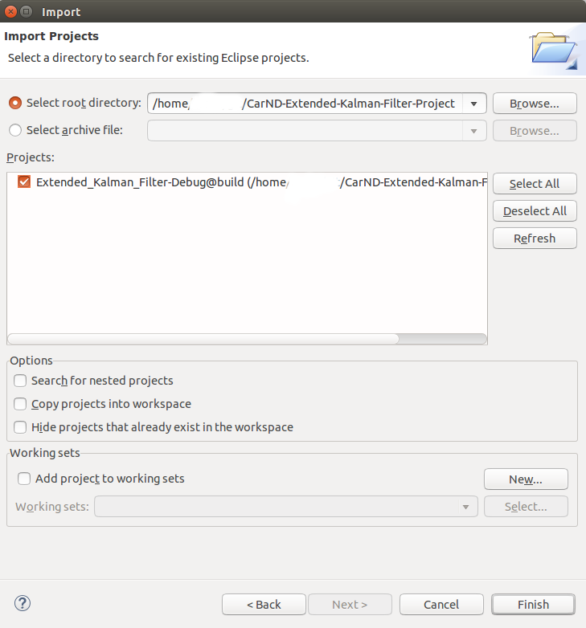
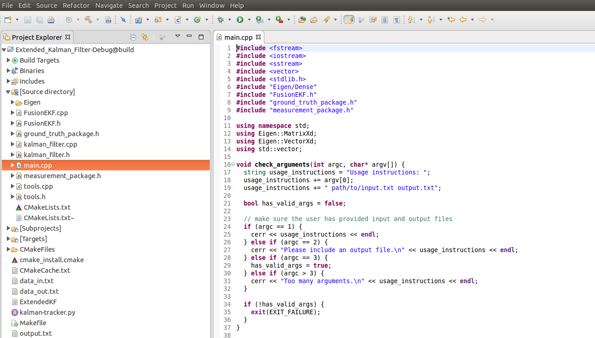

## Eclipse IDE profile

### Overview

Starting with version 2.6.0 CMake includes a generator for Eclipse CDT 4.0 or newer. It works together with the Makefile generators (i.e. "Unix Makefiles", "MinGW Makefiles", "MSYS Makefiles", and maybe "NMake Makefiles"). This generator creates a set of `.project` and `.cproject` files that can be imported in Eclipse using `File > Import > Existing Eclipse project`.

[Based on this article.](https://cmake.org/Wiki/Eclipse_CDT4_Generator)

---
### How to create Eclipse IDE project?

You will generate one!  the best way to get an Eclipse IDE project for this project is to generate one using `cmake` and it is really easy.

####1. Create a build directory
Create a build directory in your project folder as a sibling to the source directory (`/src`):

```
mkdir build
```

####2. Change `CMakeLists.txt`

1. Be sure to move `CMakeLists.txt` file to the `/src` directory:
```
mv CMakeLists.txt src
```
2. Change the project name in the  `CMakeLists.txt` 
**(IMPORTANT) Your project name should be different from your executable name and different from your build folder name.**

3. Remove  "_src_" from the path to `cpp` "_sources_". Your final `CMakeLists.txt`  should be similar to this:
```
project(Extended_Kalman_Filter)

cmake_minimum_required (VERSION 3.5)

add_definitions(-std=c++0x)

set(sources
    ./FusionEKF.cpp
    ./kalman_filter.cpp
    ./main.cpp
    ./tools.cpp)

add_executable(ExtendedKF ${sources})
```
####3. CMake 
Go to `build` directory
```
cd build
```

and run CMake with the following parameters (see below for commandline). Make sure you set your CMAKE_BUILD_TYPE to Debug if you want to debug your project with gdb inside of Eclipse CDT. This is not done automatically
```
cmake -G"Eclipse CDT4 - Unix Makefiles" -D CMAKE_BUILD_TYPE=Debug ../src/
```
####4. Make
Now, make the project:
```
make
```
You will now find two Eclipse project files in your build tree:  `.project` and `.cproject`

####5 Import the project into Eclipse

1. Open Eclipse (make sure you have the CDT 4.0 or newer).
2. Import project using Menu `File > Import`

3. Select `General > Existing projects into workspace`

4. **Browse** where your build tree is and select the root build tree directory. Keep "Copy projects into workspace" unchecked.

5. Now you should have a fully functional eclipse project


---
### Code Style
Import the google coding style settings to Eclipse:
1. Download the style sheet to some location:
[Google's C++ style guide for Eclipse](https://github.com/google/styleguide/blob/gh-pages/eclipse-cpp-google-style.xml)
2. From Eclipse go to `Window > Preferences > C/C++ > Code Style > Formatter`
3. Click `Import`
4. Select the downloaded sheet.
5. Click `Ok`